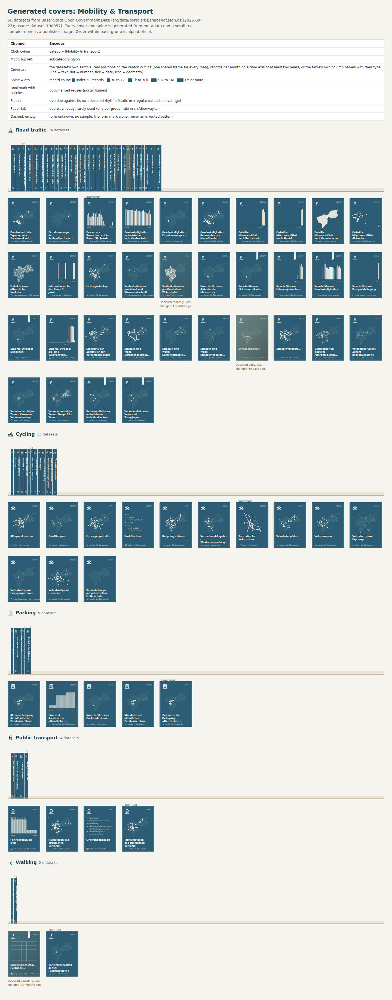

# Generated covers and spines

Every dataset gets a face computed from its metadata and a small real sample (`src/cover.ts`). Nothing is drawn by hand per dataset: same input, same cover. The covers are 2D SVG, usable in the atlas, portraits, a proposal hero and, later, as textures for a 3D library view.

Review sheet: [covers/mobility-transport.html](covers/mobility-transport.html) (58 Basel Mobility datasets, 27.09.2026).



## One channel per fact

| Channel | Encodes | Source |
|---|---|---|
| Cloth colour | category | topic decision |
| Motif, top left | subcategory glyph | `atlas-spec.ts` (Mobility family) |
| Cover art | the dataset's own sample: real positions, records per month, or column types as a weave (text = lines, numbers = dots, dates = ticks, geometry = rings) | `scripts/cover-samples.ts` |
| Spine width | record count, 5 log bands (<30, <1k, <30k, <1M, ≥1M) | catalogue |
| Bookmark with notches | documented reuses (max 5 notches) | usage dataset 100057 |
| Patina | overdue against the dataset's **own** declared rhythm, with twice the interval as grace | `modified` + `updateFrequency` |
| Paper tab "READY · RARE" | the doorway: ready, rarely used, one per group | `src/doorway.ts` |
| Dashed, empty | form unknown | never guessed |

Rules that keep it honest:
- **Static is not stale.** "No updates", "irregular" or undeclared datasets never get patina. In Basel, 3 of 58 Mobility datasets are overdue.
- **No invented patterns.** Without a sample the cover shows the form mark alone; a map service gets a plain grid, not fake data.
- **A sample is not coverage.** The art shows the first 60 features (thinned to at most 800 coordinates per dataset), and the sheet and captions say so.
- Order on a shelf is alphabetical within its group, stated on screen; position never means rank.

## Pipeline

```bash
# once per snapshot, needs network (behind a proxy: NODE_USE_ENV_PROXY=1)
npx tsx scripts/cover-samples.ts --portal bs --category "Mobility & Transport"
# review sheet
npx tsx scripts/cover-sheet.ts --portal bs --category "Mobility & Transport"
```

Samples are static (`src/data/portals/bs/cover-samples.json`, ~330 KB for 58 datasets): the covers need no live requests.

## Known limits

- Sensor datasets whose first 60 records repeat a few stations look sparse ("few locations, many measurements"). True, but worth a distinct-positions sample later.
- Spine titles at 6.4 px are for the sheet; a 3D view must use HTML labels on hover/focus.
- One cloth colour per category makes a single shelf monochrome; variety comes from the art. Other categories get their own cloth.
- Only Mobility has a glyph family; other categories fall back to the topic icon until their subcategories are checked.

## Where the covers are used

- `/library/`: the 3D shelf (docs/LIBRARY.md).
- Version 2 of the proposal page (`/v2/`), section "Unentdeckt": the doorway volumes of the three largest Mobility
  groups.
  - `npx tsx scripts/proposal-hero.ts` rewrites that block in `v2/index.html` (version 2 of the proposal page), between its markers.
    It is static HTML, needs no script, and makes no request.
  - The German reason text is built from the doorway's figures (`downloadsPerMonth`, `reuses`).
    It is not a translation of the English sentence.
  - The heading says "least used in its group", not "rarely used": the Parking pick still has
    about 169 downloads a month.

## Cover art: a shared frame (update)

The first covers read as random: a scatter of 60 points in its own extent, bars without a time
axis, and a weave of column types. Each art form now has a frame:
- **Maps** are drawn on the canton outline (dataset 100017, three communes), at one scale for
  every map. A point reads as "here in Basel", and two covers can be compared. Data reaching
  well beyond the canton, such as the Rhine or the airport, widens the frame instead of being
  cut off.
- **Time series** sit on an axis at least two years long. It has a tick at every January and
  the first and last year written out. A series of three months shows as three thin bars at the
  recent end, not three blocks.
- **Tables** show their own column names, with a type mark: line = text, dot = number,
  tick = date, ring = geometry.
- **Titles:** lines longer than 15 characters use a slightly smaller font.
- **Categories without a checked glyph family** carry their topic icon as the motif.
