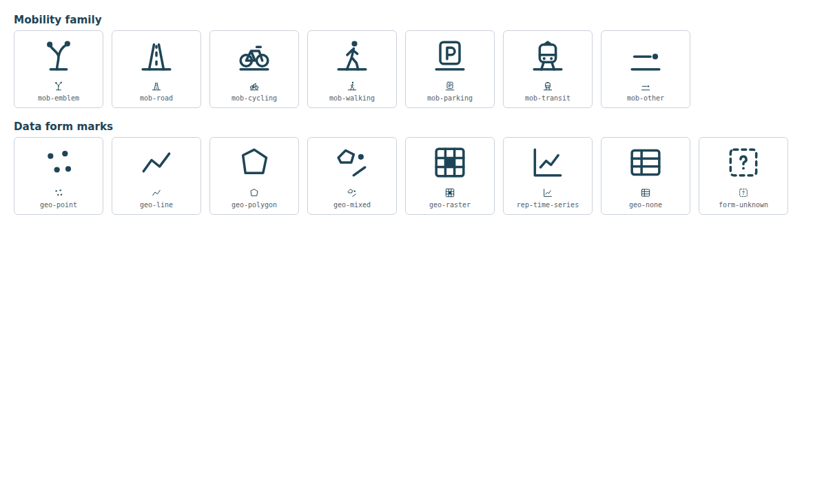

# Icon specification: Mobility & Transport (first atlas category)

The atlas gives icons three jobs, and never mixes them (`src/atlas-spec.ts`):

| Level | Job | Rule |
|---|---|---|
| Category emblem | Recognise a territory from a distance | One per checked category |
| Subcategory glyph | Which aspect of it you are entering | Only for subcategories whose content was checked; otherwise the category's fallback glyph |
| Data-form mark | What you can inspect, independent of topic | Fixed set of 8, shared by all categories |

A glyph says what a dataset **concerns**, a form mark what it **is**. Neither claims coverage or quality: a point mark on a fountain dataset does not say every fountain is included; a road glyph does not say the network is routable. Icons always reinforce a visible label; none is an icon-only control.

## Family grammar

- 24-unit grid, 1.5 stroke, round caps and joins, `currentColor` (as the rest of DataFit's set).
- **Shared motif:** every Mobility glyph stands on the same ground line (`M3.5 20.5h17`); the emblem is a route forking from it. The ground line is what makes them one family instead of five stock icons.
- Hand-drawn for DataFit (no third-party source); all coordinates within 0–24.

## Glyphs

| Name | Meaning | Reads as | Could be confused with | Fallback |
|---|---|---|---|---|
| `mob-emblem` | Mobility & Transport | A route forking from the ground to two destinations | A tree, a "Y" at 12 px (first draft did; redrawn asymmetric) | `topic-mobility` (tram) |
| `mob-road` | Road traffic | A road in perspective with lane marks | A bridge, a tower | `mob-other` |
| `mob-cycling` | Cycling | A bicycle | Motorbike (no engine drawn) | `mob-other` |
| `mob-walking` | Walking | A person mid-stride | Hiking, sport (first draft, two footprints, read as "0o" and was replaced) | `mob-other` |
| `mob-parking` | Parking | The parking sign | Letter P in other contexts | `mob-other` |
| `mob-transit` | Public transport | A tram on its rails | Train (Basel's public transport is mostly tram and bus; label disambiguates) | `mob-other` |
| `mob-other` | Mobility (other) | A path to a destination disc | An arrow | none |

## Data-form marks

| Mark | Form | Rule (`dataForm`) |
|---|---|---|
| `geo-point` | points | declared point geometry |
| `geo-line` | lines | declared line geometry |
| `geo-polygon` | areas | declared polygon geometry |
| `geo-mixed` | mixed geometry | several families declared |
| `geo-raster` | map service / file | raster or external asset without rows |
| `rep-time-series` | time series | no geometry, but a time dimension |
| `geo-none` | table | no geometry, no time dimension |
| `form-unknown` | form unknown | nothing declared; drawn dashed, never guessed |

Geometry wins over time: a sensor station with hourly values is inspected as points first.

## Still to do

- Recognition test with people: show a glyph without its label, ask what is inside, record the answer. Keep a glyph only if most people place it correctly; otherwise it stays as label reinforcement.
- Further categories only after their subcategories are checked (topic growth process, docs/MULTI_CANTON.md).
